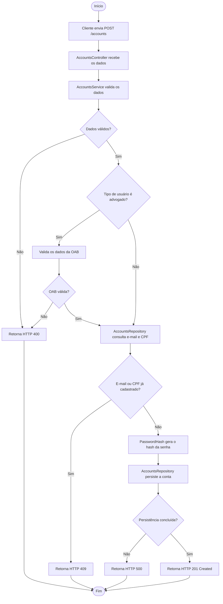

# Fluxo — REQ 01: Cadastro de usuário

```mermaid
flowchart TD
    A([Início]) --> B[Cliente envia POST /accounts]
    B --> C[AccountsController recebe os dados]
    C --> D[AccountsService valida os dados]
    D --> E{Dados válidos?}
    E -- Não --> F[Retorna HTTP 400]
    F --> Z([Fim])
    E -- Sim --> G{Tipo de usuário é advogado?}
    G -- Sim --> H[Valida os dados da OAB]
    H --> I{OAB válida?}
    I -- Não --> F
    I -- Sim --> J[AccountsRepository consulta e-mail e CPF]
    G -- Não --> J
    J --> K{E-mail ou CPF já cadastrado?}
    K -- Sim --> L[Retorna HTTP 409]
    L --> Z
    K -- Não --> M[PasswordHash gera o hash da senha]
    M --> N[AccountsRepository persiste a conta]
    N --> O{Persistência concluída?}
    O -- Não --> P[Retorna HTTP 500]
    P --> Z
    O -- Sim --> Q[Retorna HTTP 201 Created]
    Q --> Z
```
