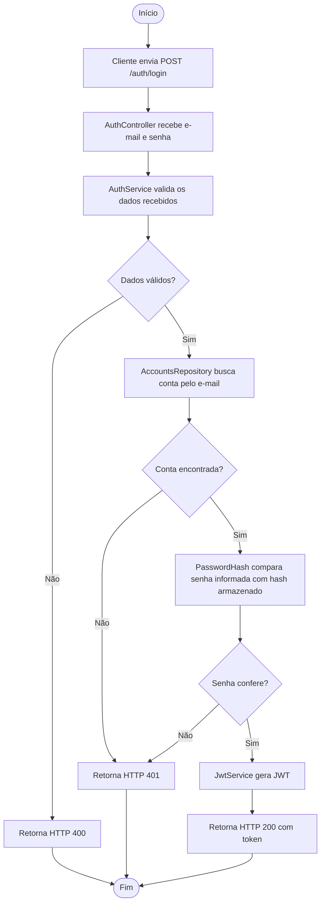

# Fluxo — REQ 03: Login

```mermaid
flowchart TD
    A([Início]) --> B[Cliente envia POST /auth/login]
    B --> C[AuthController recebe e-mail e senha]
    C --> D[AuthService valida os dados recebidos]
    D --> E{Dados válidos?}
    E -- Não --> F[Retorna HTTP 400]
    F --> Z([Fim])
    E -- Sim --> G[AccountsRepository busca conta pelo e-mail]
    G --> H{Conta encontrada?}
    H -- Não --> I[Retorna HTTP 401]
    I --> Z
    H -- Sim --> J[PasswordHash compara senha informada com hash armazenado]
    J --> K{Senha confere?}
    K -- Não --> I
    K -- Sim --> L[JwtService gera JWT]
    L --> M[Retorna HTTP 200 com token]
    M --> Z
```
