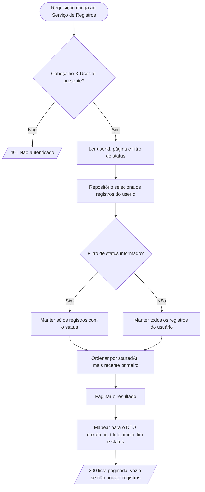

# Fluxo — REQ 12: Listar Registros

```mermaid
flowchart TD
    A1(["Requisição chega ao Serviço de Registros"]) --> A2{"Cabeçalho X-User-Id presente?"}
    A2 -- "Não" --> A3[/"401 Não autenticado"/]
    A2 -- "Sim" --> A4["Ler userId, página e filtro de status"]
    A4 --> A5["Repositório seleciona os registros do userId"]
    A5 --> A6{"Filtro de status informado?"}
    A6 -- "Sim" --> A7["Manter só os registros com o status"]
    A6 -- "Não" --> A8["Manter todos os registros do usuário"]
    A7 --> A9["Ordenar por startedAt, mais recente primeiro"]
    A8 --> A9
    A9 --> A10["Paginar o resultado"]
    A10 --> A11["Mapear para o DTO enxuto: id, título, início, fim e status"]
    A11 --> A12[/"200 lista paginada, vazia se não houver registros"/]
```
