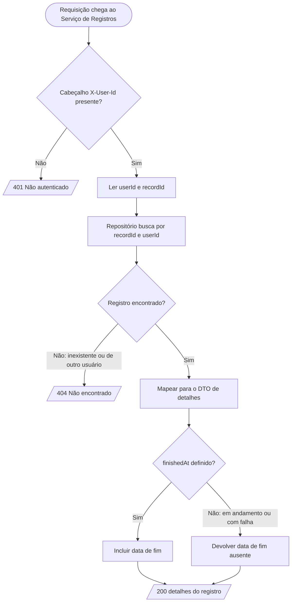

# Fluxo — REQ 13: Visualizar Registro

```mermaid
flowchart TD
    B1(["Requisição chega ao Serviço de Registros"]) --> B2{"Cabeçalho X-User-Id presente?"}
    B2 -- "Não" --> B3[/"401 Não autenticado"/]
    B2 -- "Sim" --> B4["Ler userId e recordId"]
    B4 --> B5["Repositório busca por recordId e userId"]
    B5 --> B6{"Registro encontrado?"}
    B6 -- "Não: inexistente ou de outro usuário" --> B7[/"404 Não encontrado"/]
    B6 -- "Sim" --> B8["Mapear para o DTO de detalhes"]
    B8 --> B9{"finishedAt definido?"}
    B9 -- "Sim" --> B10["Incluir data de fim"]
    B9 -- "Não: em andamento ou com falha" --> B11["Devolver data de fim ausente"]
    B10 --> B12[/"200 detalhes do registro"/]
    B11 --> B12
```
