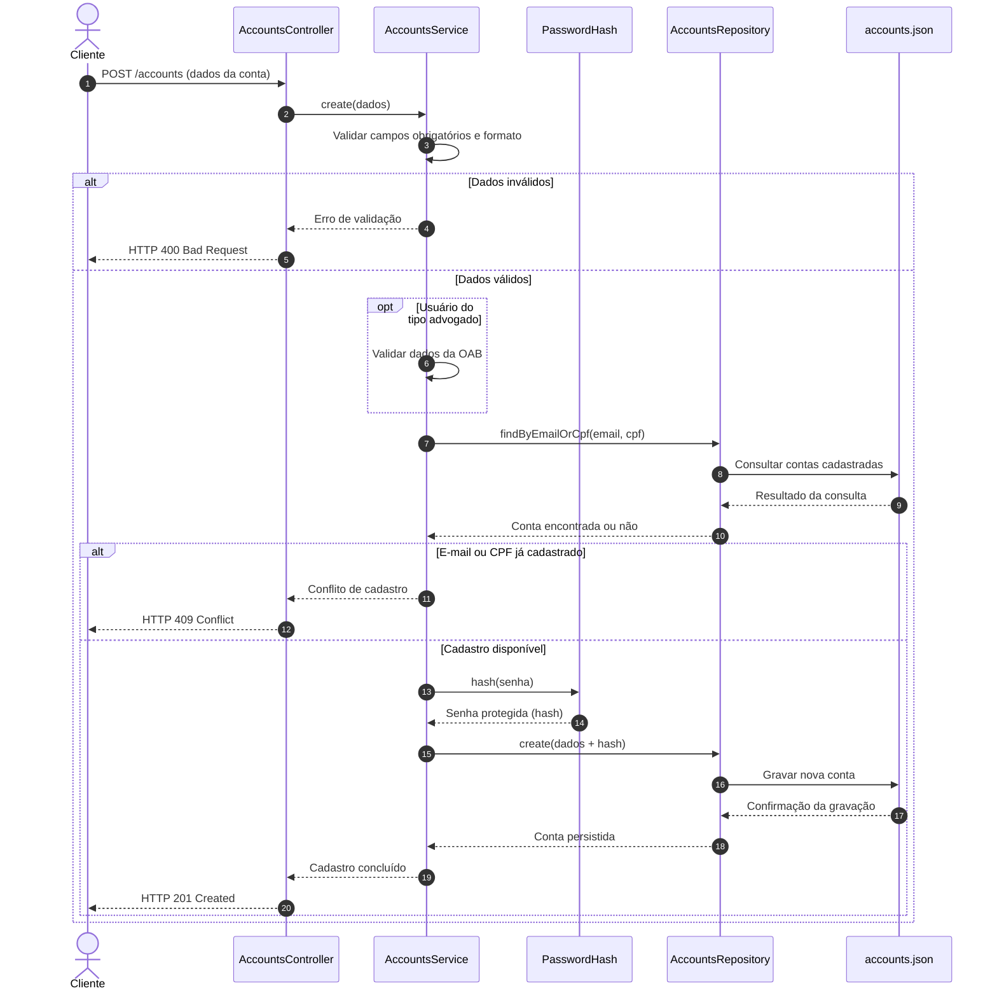

# Diagrama de sequência — REQ 01: Cadastro de usuário

```mermaid
sequenceDiagram
    autonumber
    actor Cliente
    participant Controller as AccountsController
    participant Service as AccountsService
    participant Hash as PasswordHash
    participant Repository as AccountsRepository
    participant JSON as accounts.json

    Cliente->>Controller: POST /accounts (dados da conta)
    Controller->>Service: create(dados)
    Service->>Service: Validar campos obrigatórios e formato

    alt Dados inválidos
        Service-->>Controller: Erro de validação
        Controller-->>Cliente: HTTP 400 Bad Request
    else Dados válidos
        opt Usuário do tipo advogado
            Service->>Service: Validar dados da OAB
        end
        Service->>Repository: findByEmailOrCpf(email, cpf)
        Repository->>JSON: Consultar contas cadastradas
        JSON-->>Repository: Resultado da consulta
        Repository-->>Service: Conta encontrada ou não

        alt E-mail ou CPF já cadastrado
            Service-->>Controller: Conflito de cadastro
            Controller-->>Cliente: HTTP 409 Conflict
        else Cadastro disponível
            Service->>Hash: hash(senha)
            Hash-->>Service: Senha protegida (hash)
            Service->>Repository: create(dados + hash)
            Repository->>JSON: Gravar nova conta
            JSON-->>Repository: Confirmação da gravação
            Repository-->>Service: Conta persistida
            Service-->>Controller: Cadastro concluído
            Controller-->>Cliente: HTTP 201 Created
        end
    end
```
