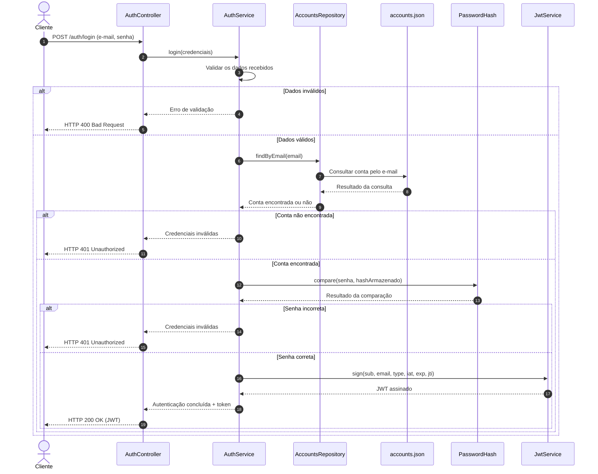

# Diagrama de sequência — REQ 03: Login

```mermaid
sequenceDiagram
    autonumber
    actor Cliente
    participant Controller as AuthController
    participant Service as AuthService
    participant Accounts as AccountsRepository
    participant JSON as accounts.json
    participant Hash as PasswordHash
    participant JWT as JwtService

    Cliente->>Controller: POST /auth/login (e-mail, senha)
    Controller->>Service: login(credenciais)
    Service->>Service: Validar os dados recebidos

    alt Dados inválidos
        Service-->>Controller: Erro de validação
        Controller-->>Cliente: HTTP 400 Bad Request
    else Dados válidos
        Service->>Accounts: findByEmail(email)
        Accounts->>JSON: Consultar conta pelo e-mail
        JSON-->>Accounts: Resultado da consulta
        Accounts-->>Service: Conta encontrada ou não

        alt Conta não encontrada
            Service-->>Controller: Credenciais inválidas
            Controller-->>Cliente: HTTP 401 Unauthorized
        else Conta encontrada
            Service->>Hash: compare(senha, hashArmazenado)
            Hash-->>Service: Resultado da comparação
            alt Senha incorreta
                Service-->>Controller: Credenciais inválidas
                Controller-->>Cliente: HTTP 401 Unauthorized
            else Senha correta
                Service->>JWT: sign(sub, email, type, iat, exp, jti)
                JWT-->>Service: JWT assinado
                Service-->>Controller: Autenticação concluída + token
                Controller-->>Cliente: HTTP 200 OK (JWT)
            end
        end
    end
```
