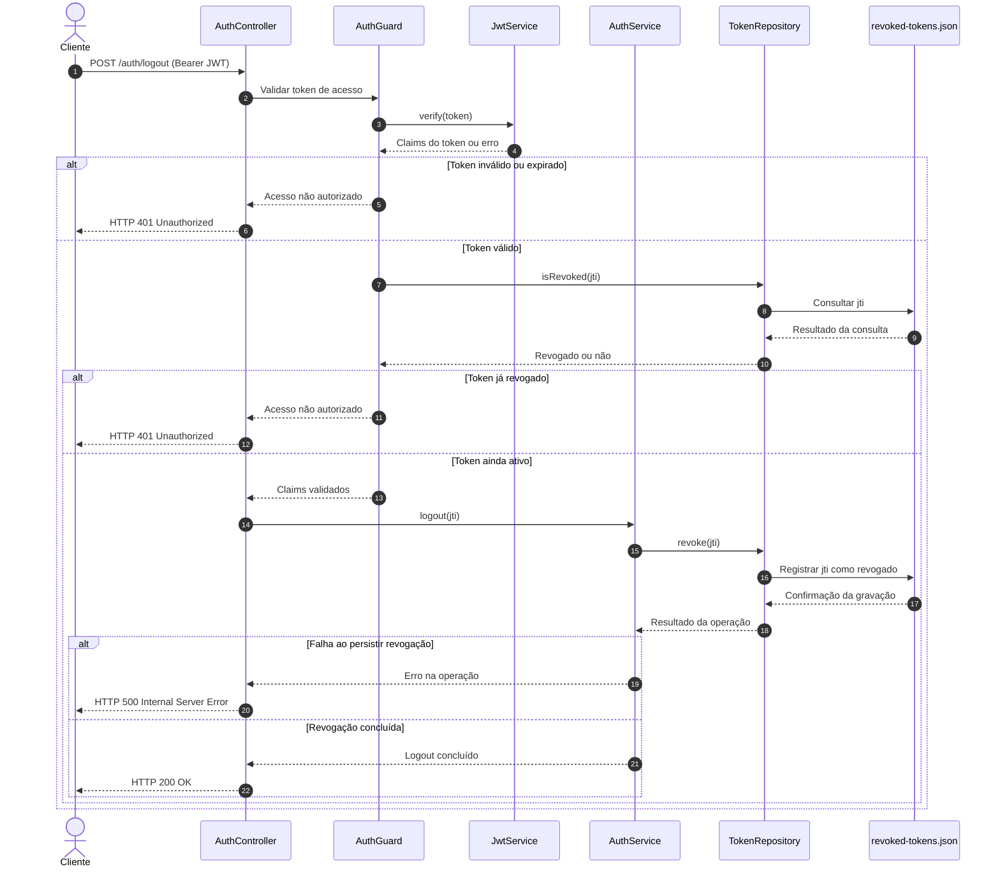

# Diagrama de sequência — REQ 04: Logout

```mermaid
sequenceDiagram
    autonumber
    actor Cliente
    participant Controller as AuthController
    participant Guard as AuthGuard
    participant JWT as JwtService
    participant Service as AuthService
    participant Repository as TokenRepository
    participant JSON as revoked-tokens.json

    Cliente->>Controller: POST /auth/logout (Bearer JWT)
    Controller->>Guard: Validar token de acesso
    Guard->>JWT: verify(token)
    JWT-->>Guard: Claims do token ou erro

    alt Token inválido ou expirado
        Guard-->>Controller: Acesso não autorizado
        Controller-->>Cliente: HTTP 401 Unauthorized
    else Token válido
        Guard->>Repository: isRevoked(jti)
        Repository->>JSON: Consultar jti
        JSON-->>Repository: Resultado da consulta
        Repository-->>Guard: Revogado ou não

        alt Token já revogado
            Guard-->>Controller: Acesso não autorizado
            Controller-->>Cliente: HTTP 401 Unauthorized
        else Token ainda ativo
            Guard-->>Controller: Claims validados
            Controller->>Service: logout(jti)
            Service->>Repository: revoke(jti)
            Repository->>JSON: Registrar jti como revogado
            JSON-->>Repository: Confirmação da gravação
            Repository-->>Service: Resultado da operação

            alt Falha ao persistir revogação
                Service-->>Controller: Erro na operação
                Controller-->>Cliente: HTTP 500 Internal Server Error
            else Revogação concluída
                Service-->>Controller: Logout concluído
                Controller-->>Cliente: HTTP 200 OK
            end
        end
    end
```
