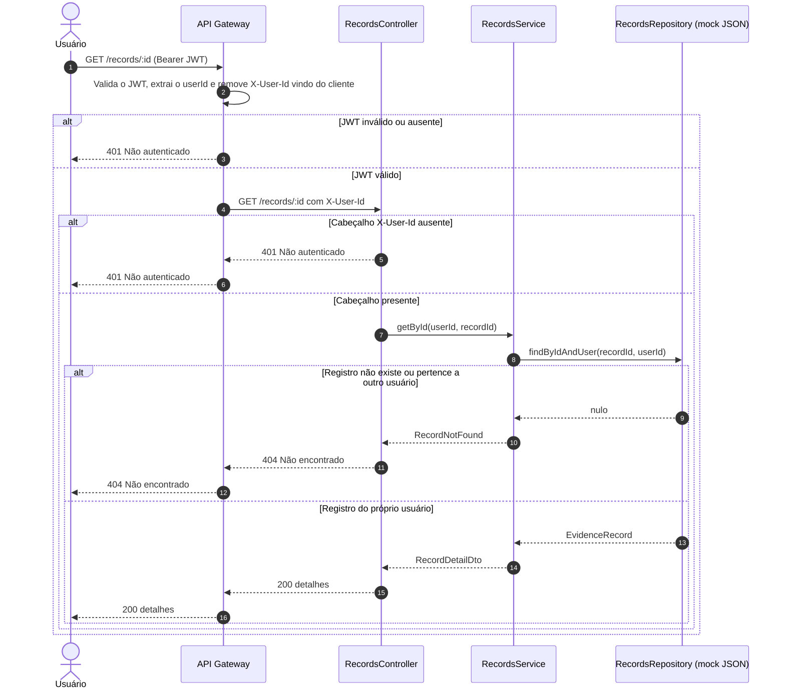

# Diagrama de sequência — REQ 13: Visualizar Registro

O API Gateway aparece para mostrar de onde vem o `X-User-Id`, mas ainda não faz parte da implementação.

```mermaid
sequenceDiagram
    autonumber
    actor U as Usuário
    participant G as API Gateway
    participant C as RecordsController
    participant S as RecordsService
    participant R as RecordsRepository (mock JSON)

    U->>G: GET /records/:id (Bearer JWT)
    G->>G: Valida o JWT, extrai o userId e remove X-User-Id vindo do cliente
    alt JWT inválido ou ausente
        G-->>U: 401 Não autenticado
    else JWT válido
        G->>C: GET /records/:id com X-User-Id
        alt Cabeçalho X-User-Id ausente
            C-->>G: 401 Não autenticado
            G-->>U: 401 Não autenticado
        else Cabeçalho presente
            C->>S: getById(userId, recordId)
            S->>R: findByIdAndUser(recordId, userId)
            alt Registro não existe ou pertence a outro usuário
                R-->>S: nulo
                S-->>C: RecordNotFound
                C-->>G: 404 Não encontrado
                G-->>U: 404 Não encontrado
            else Registro do próprio usuário
                R-->>S: EvidenceRecord
                S-->>C: RecordDetailDto
                C-->>G: 200 detalhes
                G-->>U: 200 detalhes
            end
        end
    end
```
