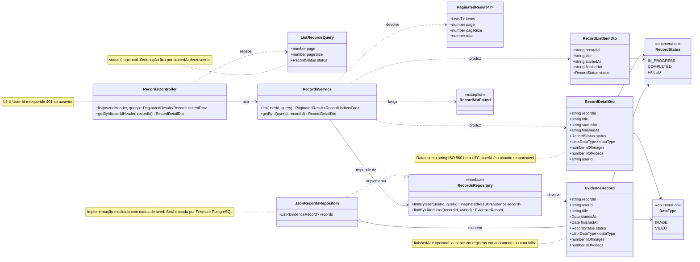

# Diagrama UML de classes: Serviço de Registros (REQ 12 e REQ 13)

```mermaid
classDiagram
    direction LR

    class RecordStatus {
        <<enumeration>>
        IN_PROGRESS
        COMPLETED
        FAILED
    }

    class DataType {
        <<enumeration>>
        IMAGE
        VIDEO
    }

    class EvidenceRecord {
        +string recordId
        +string userId
        +string title
        +Date startedAt
        +Date finishedAt
        +RecordStatus status
        +List~DataType~ dataType
        +number nOfImages
        +number nOfVideos
    }
    note for EvidenceRecord "finishedAt é opcional: ausente em registros em andamento ou com falha"

    class ListRecordsQuery {
        +number page
        +number pageSize
        +RecordStatus status
    }
    note for ListRecordsQuery "status é opcional. Ordenação fixa por startedAt decrescente"

    class PaginatedResult~T~ {
        +List~T~ items
        +number page
        +number pageSize
        +number total
    }

    class RecordListItemDto {
        +string recordId
        +string title
        +string startedAt
        +string finishedAt
        +RecordStatus status
    }

    class RecordDetailDto {
        +string recordId
        +string title
        +string startedAt
        +string finishedAt
        +RecordStatus status
        +List~DataType~ dataType
        +number nOfImages
        +number nOfVideos
        +string userId
    }
    note for RecordDetailDto "Datas como string ISO 8601 em UTC. userId é o usuário responsável"

    class RecordsController {
        +list(userIdHeader, query) PaginatedResult~RecordListItemDto~
        +getById(userIdHeader, recordId) RecordDetailDto
    }
    note for RecordsController "Lê X-User-Id e responde 401 se ausente"

    class RecordsService {
        +list(userId, query) PaginatedResult~RecordListItemDto~
        +getById(userId, recordId) RecordDetailDto
    }

    class RecordsRepository {
        <<interface>>
        +findByUser(userId, query) PaginatedResult~EvidenceRecord~
        +findByIdAndUser(recordId, userId) EvidenceRecord
    }

    class JsonRecordsRepository {
        -List~EvidenceRecord~ records
    }
    note for JsonRecordsRepository "Implementação mockada com dados de seed. Será trocada por Prisma e PostgreSQL"

    class RecordNotFound {
        <<exception>>
    }

    RecordsController --> RecordsService : usa
    RecordsController ..> ListRecordsQuery : recebe
    RecordsService --> RecordsRepository : depende de
    JsonRecordsRepository ..|> RecordsRepository : implementa
    JsonRecordsRepository o-- EvidenceRecord : mantém
    RecordsRepository ..> EvidenceRecord : devolve
    RecordsService ..> RecordListItemDto : produz
    RecordsService ..> RecordDetailDto : produz
    RecordsService ..> RecordNotFound : lança
    RecordsService ..> PaginatedResult : devolve
    EvidenceRecord --> RecordStatus
    EvidenceRecord --> DataType
    RecordListItemDto --> RecordStatus
    RecordDetailDto --> RecordStatus
    RecordDetailDto --> DataType
```
